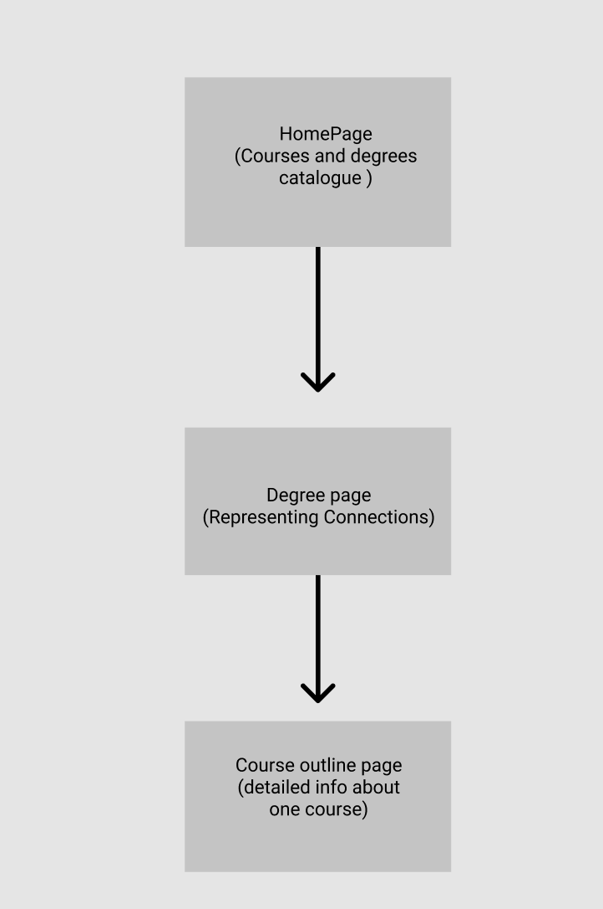

1. Almost represent the course information like a catalogue, the horizontal axis is the time, only shows the courses available in this term, the vertical axis is the degree.

2. Click the degree then jump to degree detailed page, which representing courses by core courses and electives

3. Each floating course is an object, you can click the course then the page will jump to a detaild page like 'course outline'page

